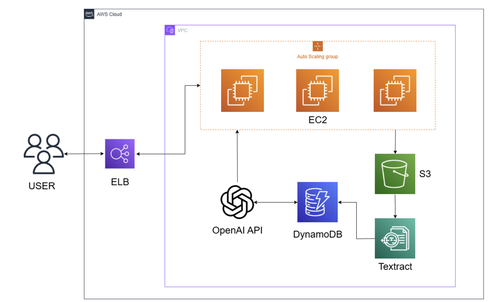

# PDF Course Instructor

A Retrieval-Augmented Generation (RAG)–powered PDF Q&A system running on AWS. Users can upload PDFs, have text extracted and indexed in DynamoDB via Textract, then ask questions answered by OpenAI API over the extracted content. ELB + Auto Scaling ensures high availability and scalability.

---

## Project Overview

Modern LLMs can hallucinate or lack domain knowledge. This project mitigates that by:
1. **Extracting** PDF text with AWS Textract  
2. **Indexing** chunks in DynamoDB  
3. **Retrieving** relevant chunks at query time  
4. **Augmenting** prompts to OpenAI API for precise answers  

### Workflow

- Users upload a PDF → text is extracted to S3 & DynamoDB → user questions trigger a RAG workflow → answer returned.

---

## Architecture



1. **ELB** receives user HTTP requests and forwards to EC2 Auto Scaling group  
2. **EC2 instances** handle:
   - PDF upload → S3  
   - Trigger Textract to extract text → DynamoDB  
   - Query workflow: retrieve chunks from DynamoDB → call OpenAI API → respond to client  
3. **DynamoDB** stores text chunks and vectors for fast retrieval  
4. **S3** stores original PDF files  
5. **ELB + Auto Scaling** provide load balancing and autoscaling
6. **ChatGPT API** response answer

---

## Features

- Upload PDF and extract text automatically  
- Fast, vector-based retrieval over document chunks  
- RAG integration with OpenAI for accurate, context-aware answers  
- Fully managed AWS backend (Textract, S3, DynamoDB, EC2, ELB)  
- Auto Scaling for dynamic load handling  

---

## Tech Stack

- **Backend**: Python 3.9, Flask, RAG pattern  
- **AWS Services**:
  - EC2 (t3.medium) with Auto Scaling Group  
  - Elastic Load Balancer (ELB)  
  - S3  
  - Textract  
  - DynamoDB  
  - IAM Roles, VPC, CloudWatch  

---

## Getting Started

### Prerequisites

- AWS account
- Amazon Linux 2023, instance type = t3.medium, volume = 30 Gib
- EC2 requiresan  IAM role; otherwise, you cannot receive the LLM response
- Python 3.9  
- OpenAI API key

### Local Development

```bash
# 1. Install dependencies
pip install --upgrade pip
pip install --no-cache-dir \
  --extra-index-url https://download.pytorch.org/whl/cpu \
  torch==2.1.2 torchvision==0.16.2 torchaudio==2.1.2
pip install -r requirements.txt

# 2. Set environment variables
export S3_BUCKET="your-s3-bucket-name"
export DDB_TABLE_NAME="PdfTextChunks"
export OPENAI_API_KEY="your-openai-api-key"
```

### auto turn on your app
pip3 install gunicorn
(app.py debug mode = false)

1. sudo nano /etc/systemd/system/pdfweb.service

2. 
```bash
###############################################################
[Unit]
Description=Gunicorn instance to serve PDF Web App
After=network.target

[Service]
User=ec2-user

WorkingDirectory=/home/ec2-user/pdf_web

Environment=S3_BUCKET=pdf-teacher-materials-XXXXXXX
Environment=DDB_TABLE_NAME=PdfTextChunks

# If you’re using virtualenv, uncomment the following line and update it to your venv path; otherwise, delete it.
# Environment="PATH=/home/ec2-user/pdf_web/venv/bin"

# Use Gunicorn to launch: 4 workers, backlog of 1024, bound to 0.0.0.0:8080
# Note: replace /usr/local/bin/gunicorn with the path returned by `which gunicorn`
ExecStart=/home/ec2-user/.local/bin/gunicorn -w 4 --backlog 1024 -b 0.0.0.0:808>

# restart if crush
Restart=always
RestartSec=5

[Install]
WantedBy=multi-user.target
###############################################################
```

3. make sure your services are running
```bash
sudo systemctl status pdfweb.service
ps aux | grep gunicorn
sudo lsof -i:8080
```


### AMI user data(for ASG)
```bash
#!/bin/bash

sudo dnf install -y glibc-all-langpacks

sudo localedef -i zh_TW -f UTF-8 zh_TW.UTF-8 || true

cat <<EOF | sudo tee /etc/locale.conf
LANG=zh_TW.UTF-8
LC_ALL=zh_TW.UTF-8
EOF

export LANG=zh_TW.UTF-8
export LC_ALL=zh_TW.UTF-8

Python, UTF-8
echo 'export PYTHONIOENCODING=utf-8' | sudo tee /etc/profile.d/python-io-encoding.sh


sudo dnf update -y
sudo dnf install -y python3 python3-pip

cd /home/ec2-user

sudo python3 -m pip install --upgrade pip setuptools


sudo dnf install -y python3-requests python3-urllib3 python3-six

sudo python3 -m pip install --upgrade --ignore-installed requests urllib3 six

sudo pip install --no-cache-dir \
  --extra-index-url https://download.pytorch.org/whl/cpu \
  torch==2.1.2 torchvision==0.16.2 torchaudio==2.1.2

sudo pip install --no-deps -r requirements.txt

export S3_BUCKET=pdf142
export DDB_TABLE_NAME=pdf142

source ~/.bashrc
echo "S3_BUCKET=$S3_BUCKET"
echo "DDB_TABLE_NAME=$DDB_TABLE_NAME"


chmod +x /home/ec2-user/app.py

nohup python3 /home/ec2-user/app.py > /var/log/app.log 2>&1 &


sudo killall -9 python3
sudo pkill -f app.py
pip3 install gunicorn
nohup gunicorn -w 4 --backlog 1024 -b 0.0.0.0:8080 app:app > gunicorn.log 2>&1 &
ps aux | grep gunicorn | grep -v grep
```
